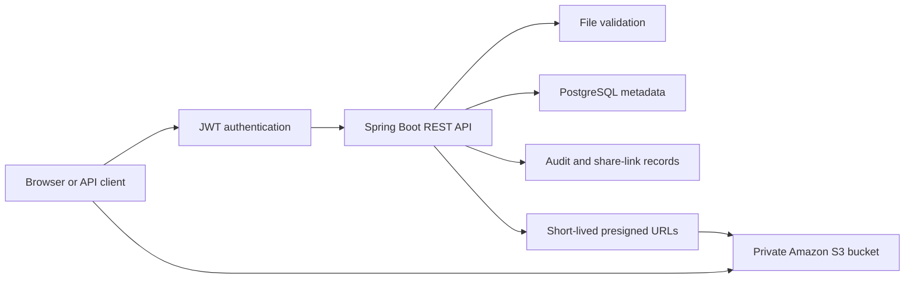

# CloudVault

CloudVault is a private document workspace built with Spring Boot, PostgreSQL,
and Amazon S3. It is designed as a secure client document exchange portal for
small professional-service teams.

The application includes account registration, JWT login, per-user file
ownership, presigned browser transfers, expiring share links, audit history,
and a responsive React dashboard.

## Current Features

- Upload PDF, PNG, JPEG, and text files up to 10 MB.
- Use a responsive React dashboard with registration, login, server-side search and
  sorting, upload progress, downloads, sharing, and deletion controls.
- Drag files onto the page or select them from the system file picker.
- Transfer files directly between clients and private S3 using expiring URLs.
- Fall back to authenticated server uploads when direct browser-to-S3 CORS is
  not configured.
- Verify direct uploads with S3 before marking metadata as available.
- Register users and authenticate with short-lived JWT access tokens.
- Hash passwords with BCrypt; plaintext passwords are never stored.
- Isolate every file by owner in both PostgreSQL queries and S3 object keys.
- Store file bytes in a private Amazon S3 bucket.
- Store searchable file metadata in PostgreSQL.
- List files with pagination, server-side filename search, and safe sorting.
- Create revocable share links that expire after one hour, one day, or seven
  days while keeping the S3 bucket private.
- Store only SHA-256 hashes of share tokens, so raw tokens cannot be recovered
  from the database.
- Record owner-scoped audit events for uploads, downloads, deletions, share-link
  creation, revocation, and access.
- Stream file downloads without writing files to local disk.
- Delete both the S3 object and its database metadata.
- Generate UUID-based object keys to avoid filename collisions.
- Load AWS credentials from the standard AWS credential provider chain.
- Apply Flyway database migrations at startup.
- Return consistent JSON errors without exposing AWS credentials or internals.
- Publish Swagger UI and Spring Boot health endpoints.
- Run automated service and application-context tests in GitHub Actions.

## Architecture



## Technology

- Java 21
- React 19 and Vite
- Spring Boot 3.5
- Spring Web and Bean Validation
- Spring Security and OAuth2 Resource Server JWT support
- Spring Data JPA
- PostgreSQL and Flyway
- AWS SDK for Java v2
- OpenAPI/Swagger UI
- JUnit, Mockito, and H2
- Gradle, npm, Docker Compose, and GitHub Actions

## Prerequisites

- JDK 21
- AWS CLI with the `file-java90` profile
- Access to the private `file-java90` bucket in `eu-north-1`
- PostgreSQL, or Docker Desktop for the provided Compose service

The application never stores AWS access keys in source code. For local
development, it uses the restricted IAM profile created with:

```powershell
aws configure --profile file-java90
```

## Local Setup

Start PostgreSQL:

```powershell
docker compose up -d postgres
```

This workspace also has a portable PostgreSQL 18 installation. Start or stop it
after a reboot with:

```powershell
.\scripts\start-postgres.ps1
.\scripts\stop-postgres.ps1
```

Set the AWS profile for the current PowerShell session:

```powershell
$env:AWS_PROFILE="file-java90"
$env:AWS_REGION="eu-north-1"
$env:S3_BUCKET="file-java90"

$bytes = New-Object byte[] 32
[Security.Cryptography.RandomNumberGenerator]::Fill($bytes)
$env:JWT_SECRET=[Convert]::ToBase64String($bytes)
```

Keep the same `JWT_SECRET` between restarts while developing. Changing it
immediately invalidates previously issued access tokens.

Run the application:

```powershell
.\gradlew.bat bootRun
```

Gradle installs, tests, and builds the React frontend before packaging Spring
Boot. For frontend-only development with hot reload:

```powershell
cd frontend
npm install
npm run dev
```

Vite runs at `http://localhost:5173` and proxies API requests to Spring Boot on
port `8080`.

Useful URLs:

- Dashboard: `http://localhost:8080/`
- Swagger UI: `http://localhost:8080/swagger-ui.html`
- API specification: `http://localhost:8080/v3/api-docs`
- Health check: `http://localhost:8080/actuator/health`

## API

| Method | Endpoint | Purpose |
| --- | --- | --- |
| `POST` | `/api/auth/register` | Register and receive a JWT |
| `POST` | `/api/auth/login` | Log in and receive a JWT |
| `POST` | `/api/files` | Upload a multipart file |
| `POST` | `/api/files/upload-requests` | Create a direct S3 upload URL |
| `POST` | `/api/files/{id}/complete` | Verify and complete a direct upload |
| `GET` | `/api/files?page=0&size=20&query=report&sort=name&direction=asc` | Search and sort file metadata |
| `GET` | `/api/files/{id}/download` | Download a file |
| `GET` | `/api/files/{id}/download-url` | Create a direct S3 download URL |
| `DELETE` | `/api/files/{id}` | Delete a file |
| `POST` | `/api/files/{id}/shares` | Create an expiring share link |
| `GET` | `/api/files/{id}/shares` | List a file's share-link history |
| `DELETE` | `/api/shares/{id}` | Revoke a share link |
| `GET` | `/api/activity` | List owner-scoped audit events |
| `GET` | `/s/{token}` | Resolve a public share token to a short-lived S3 URL |

Example upload:

```powershell
$login = Invoke-RestMethod `
  -Method POST `
  -Uri http://localhost:8080/api/auth/login `
  -ContentType "application/json" `
  -Body '{"email":"sarthak@example.com","password":"StrongPass123"}'

curl.exe -X POST http://localhost:8080/api/files `
  -H "Authorization: Bearer $($login.accessToken)" `
  -F "file=@C:\path\to\document.pdf"
```

For direct browser uploads:

1. Call `POST /api/files/upload-requests` with filename, content type, and size.
2. Send the exact file bytes to `uploadUrl` using the returned method and headers.
3. Call `POST /api/files/{id}/complete`.
4. Request `GET /api/files/{id}/download-url` when a temporary download is needed.

The completion call rejects and removes objects whose S3 size or content type
does not match the original upload request.

## Dashboard

Open `http://localhost:8080/` after starting the application. The dashboard:

- Is built with React components and bundled with Vite into the Spring Boot JAR.
- Stores the JWT only in browser session storage, so closing the browser clears
  the local session.
- Shows only files owned by the authenticated account.
- Prefers short-lived direct S3 upload URLs and verifies each upload afterward.
- Falls back to the multipart API when S3 browser CORS is unavailable.
- Uses temporary S3 download URLs and never exposes AWS credentials.
- Creates and revokes expiring links without making the bucket or object public.
- Shows recent security-relevant activity for the signed-in owner.

## Configuration

| Environment variable | Default | Description |
| --- | --- | --- |
| `AWS_PROFILE` | AWS SDK default chain | Local AWS profile name |
| `AWS_REGION` | `eu-north-1` | S3 bucket region |
| `S3_BUCKET` | `file-java90` | Private S3 bucket |
| `JWT_SECRET` | Required | Random signing secret of at least 32 characters |
| `JWT_EXPIRATION` | `PT1H` | Access-token lifetime |
| `PRESIGNED_URL_EXPIRATION` | `PT10M` | Direct S3 URL lifetime |
| `DB_URL` | `jdbc:postgresql://localhost:5432/cloudvault` | JDBC URL |
| `DB_USERNAME` | `cloudvault` | Database user |
| `DB_PASSWORD` | `cloudvault` | Database password |

## Security Decisions

- S3 Block Public Access stays enabled.
- The application uses a least-privilege IAM user locally.
- AWS secrets are stored in the shared AWS credentials file, not this project.
- API requests are stateless and protected by signed, expiring JWTs.
- Passwords are stored as BCrypt hashes.
- File lookups always include the authenticated owner ID.
- Presigned links expire after ten minutes by default.
- Share links are revocable, expire automatically, and store only a token hash.
- Public share requests receive a fresh short-lived S3 redirect and never see
  AWS credentials.
- Audit events retain the filename snapshot after a file is deleted.
- Direct uploads remain pending until their S3 metadata is verified.
- Object keys are generated by the server and do not trust uploaded filenames.
- Allowed content types and file size are validated before upload.
- Storage failures are logged server-side and returned as generic API errors.

MIME types are currently checked from the multipart request and are not strong
proof of file contents. Content-signature detection is planned before calling
the project production-ready.

## Roadmap

1. Add LocalStack and Testcontainers integration tests.
2. Add refresh tokens, logout/revocation, and account management.
3. Add malware scanning and content-signature detection.
4. Deploy the application and database with infrastructure as code.
